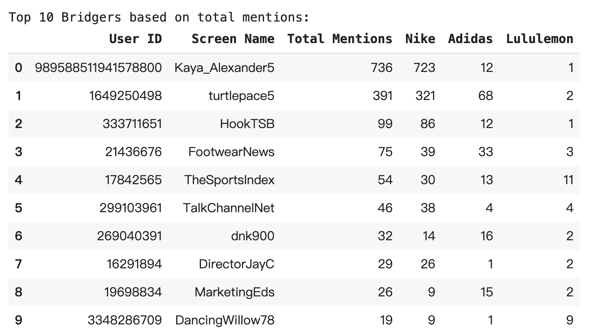
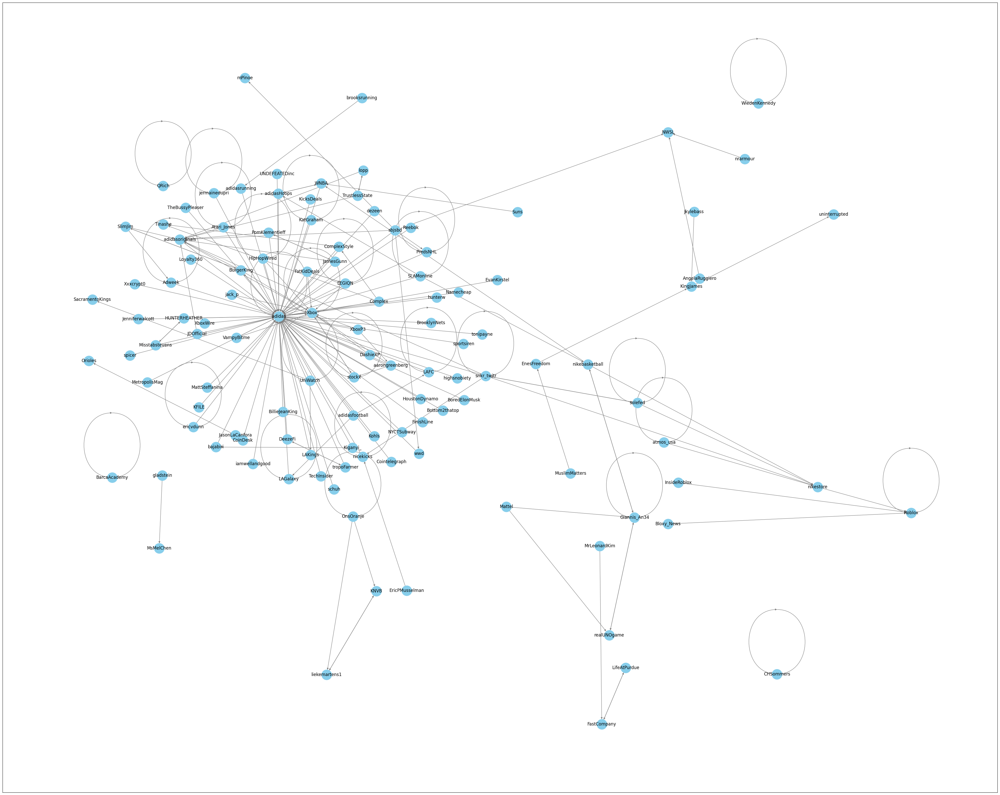
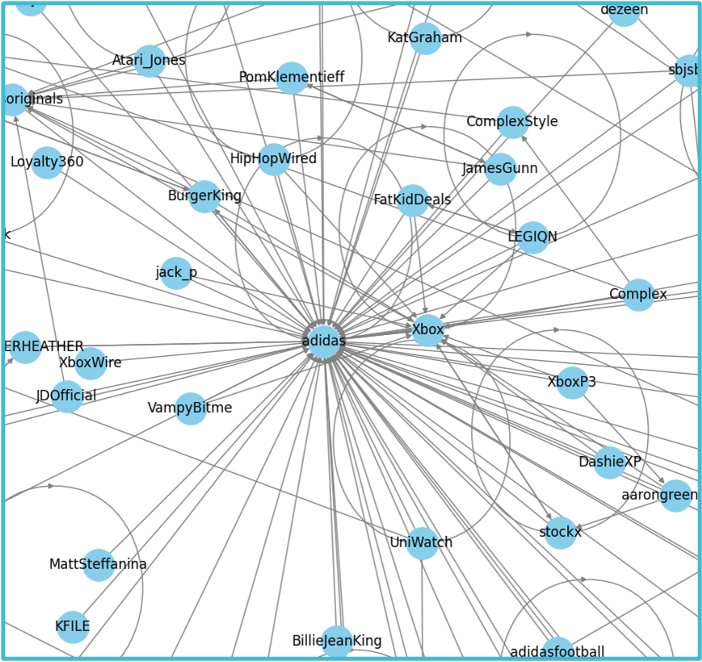
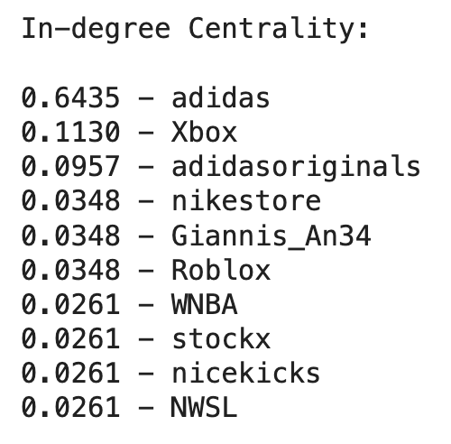
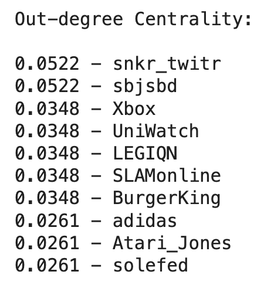
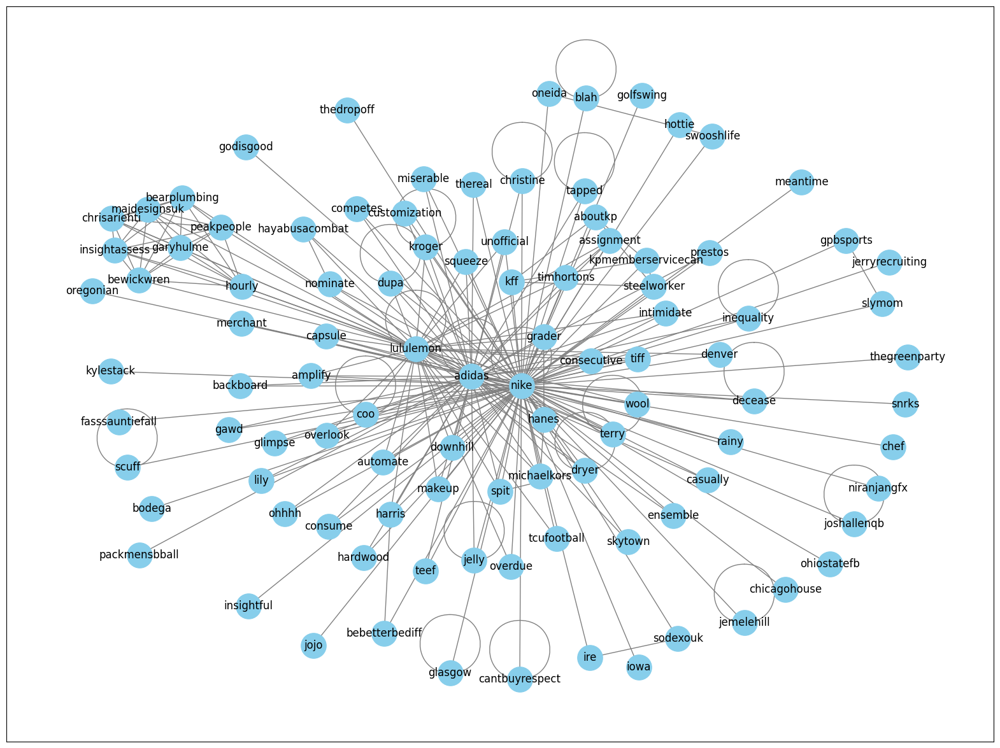
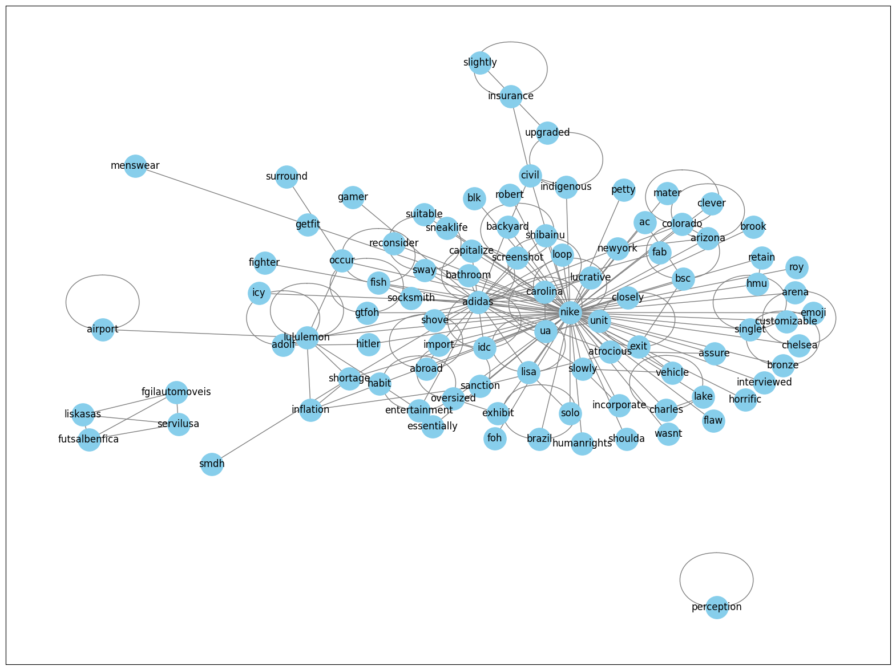
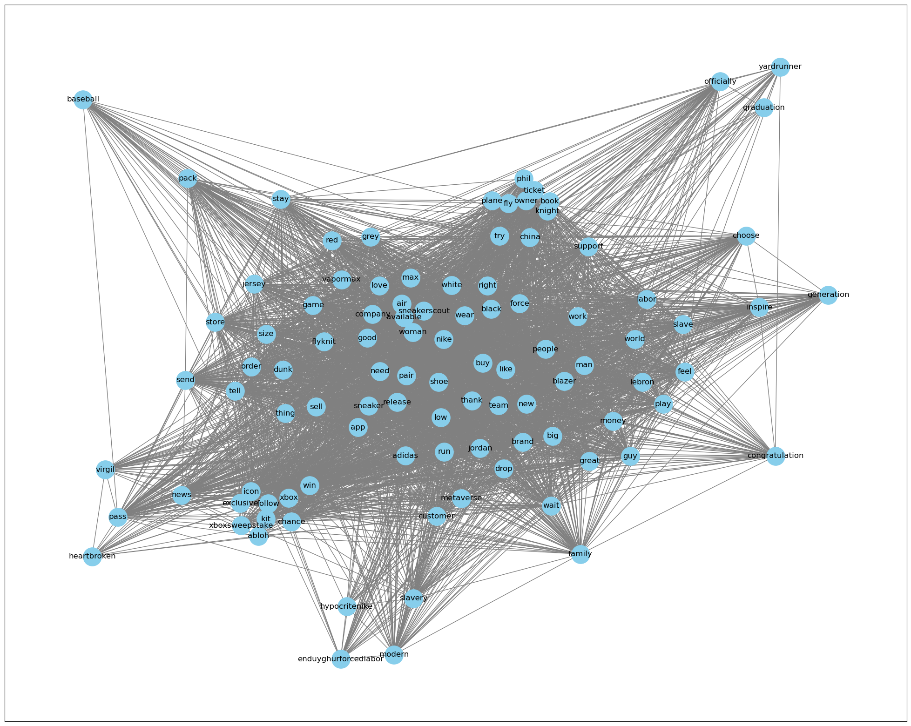

CU Boulder MSDS course work  
DTSA 5800 Network Analysis for Marketing Analytics  

## Tweets Network Analysis

### Tast & Data

The task of this project is to analyze how consumers discuss three competing brands: **Nike**, **Adidas**, and **Lululemon**.

Data contains 175,078 tweets from October 1, 2021, to January 1, 2022., retrieved via [Twitter API's Search Endpoint](https://developer.x.com/en/docs/twitter-api/v1/tweets/search/api-reference/get-search-tweets)

- Total number of created_time_points: 175078 
- Range of Dates: 2021-10-01 - 2022-01-01 
- Unique location count: 6 
- List of locations: ['Unknown', 'US', 'CA', 'TR', 'MX', 'GR‘] 
- There are 81 bridgers in this tweets dataset who mention all three brands.

The table above reflects the extent of mention activity among different bridgers, with Nike being the most mentioned.

### Tweets Mentions Network

- 163286 tweets mention any of the brands ['nike', 'adidas', 'lululemon'], posted by 97437 users.
- 176 users each have at least 2 tweets and 100,1000 followers, account for 0.18 % of the total users.
- Among the selected users, 116 users have interactions involving 190 mentions.

<!-- |||
|---|---|
||| -->

  
  

However, among the mentions by these influential users, the brand Adidas occupies a critical central position in the network.

<!-- |||
|---|---|
| || -->

  
  

Adidas has the highest in-degree centrality, shows its widespread visibility and popularity on social media. Xbox and adidasoriginals also have high mention frequencies. 

In terms of out-degree centrality, snkr_twitr and sbjsbd (SportsBusiness Journal/SportsBusiness Daily) are the most active users, frequently mentioning other brands or users, showing their high interaction engagement.

### Tweets Semantic Networks

The following semantic networks were plotted using two approaches with NLTK or TMtoolkit.

#### Network nltk 1 
- remove url 
- keep only letters 
- lemmatize 
- remove stopwords 
- select top 100 words

From the graph, it can be observed that Nike, Adidas, and Lululemon are all positioned at the center of the network, indicating that these comments are focused on these three brands, which aligns with our expectations.

Although there are some meaningful words in the diagram, such as "consume," "customization," and "makeup," most of the terms are usernames that were mentioned. 

#### Network nltk 3 
- \+ remove mentions and hashtags

Therefore, this graph was generated with the comments where mentions and hashtags were removed.

Nike and adidas, are in the central position of the graph, but lululemon is comparatively less central. Words associated with lululemon such as inflation, airport, shortage, icy, habit, entertainment, etc., could categorize it as a popular sports brand practical for leisure use.

Words linked to adidas like import abroad and capitalize indicate its active participation in international trade and market expansion, while words like gamer, entertainment, and screenshot may relate to digital entertainment and social media promotion. The terms backyard and bathroom suggest its involvement in home life products. This classifies adidas as an international, diversified brand integrated into everyday life.

The words associated with Nike are very similar to those of adidas, but include additional terms like lucrative, customizable, arena, assure, incorporate, human rights, indigenous, and several American place names like New York. This can suggest that Nike may be perceived as more professional and trustworthy, relatively upscale, and particularly active in the US.

####  Bridge Words

After the token process above, 18 bridge words linked to ['nike', 'adidas', 'lululemon'] were found.

'supplychain', 'shopper', 'autumn', 'quantity', 'spy', 'clearance', 'columbia', 'intimidate', 'calvin', 'counter', 'practically', 'swipe', 'manhattan', 'usps', 'shortage', 'profitable', 'participant', 'infringe'

#### Network tmtk 3

The network above plotted using tmtoolkit to process tokens, resulting in some different findings from using nltk. It can be observed that some words cluster together, representing themes mentioned in the tweets. These clusters allow us to explore what topics users are more interested in.

For example, words like "icon", "exclusive", "follow", "xboxsweepstake", "chance", and "kit" are related to events organized by brands.

Words such as "news", "virgil", "pass", and "heartbroken" seem to be related to discussions about the death of fashion designer Virgil Abloh.

Words like "phil", "knight", "plane", "ticket", and "china" are related to the issue of Uyghur forced labor. Phil Knight is the co-founder and former CEO of Nike. The terms "hypocritenike", "modern", "slavery", and "enduyghurforcedlabor" also indicate this issue. These terms show that there was significant discussion and reaction regarding this topic during the period.

There are also some clusters related to product promotion or sales.

Additionally, words like "graduation", "congratulation", "thank", "love", and "buy" indicate that consumers often discuss their fondness for these products and their use as gifts.
